<div align="center">

  <!-- BANNER DINÁMICO (Dark/Light Automático) -->
  <picture>
    <source media="(prefers-color-scheme: dark)" srcset="./output/dark.svg">
    <source media="(prefers-color-scheme: light)" srcset="./output/light.svg">
    
  </picture>

  <br/><br/>

  <!-- BADGES RÁPIDOS -->
  <p align="center">
    <a href="https://github.com/Mikee0102">
      
    </a>
    <a href="https://github.com/Mikee0102">
      
    </a>
  </p>

</div>

---

### 🚀 About Me

```bash
❯ whoami
  Miguel Angel Conde Vazquez — Software Developer & Architecture Student

❯ cat stack.json
  {
    "frontend": ["Svelte", "JavaScript", "Flutter"],
    "backend":  ["Node.js", "Express.js", "Python"],
    "database": ["PostgreSQL"],
    "tools":    ["Git", "Docker", "Linux"]
  }